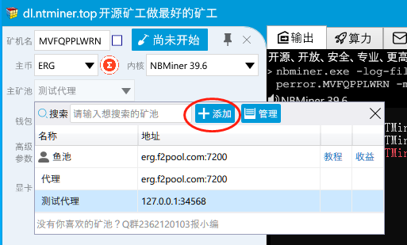
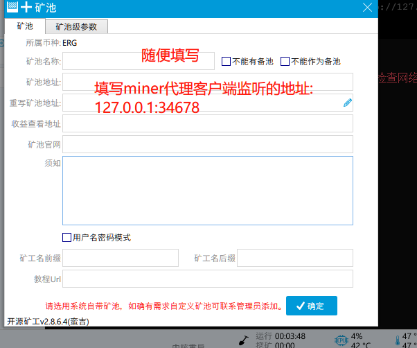
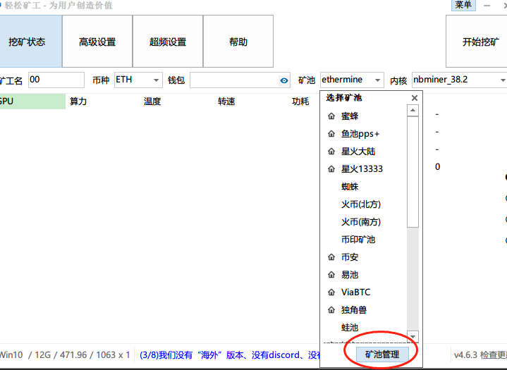
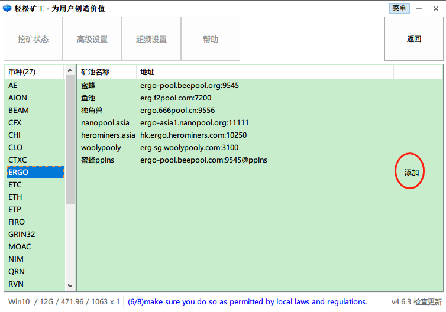
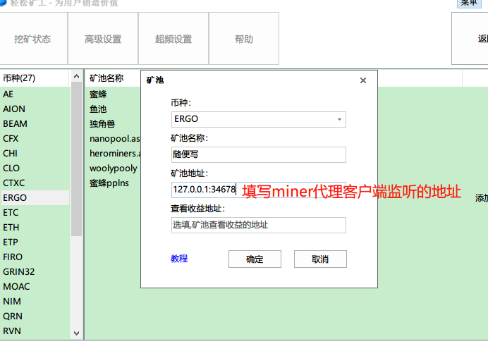
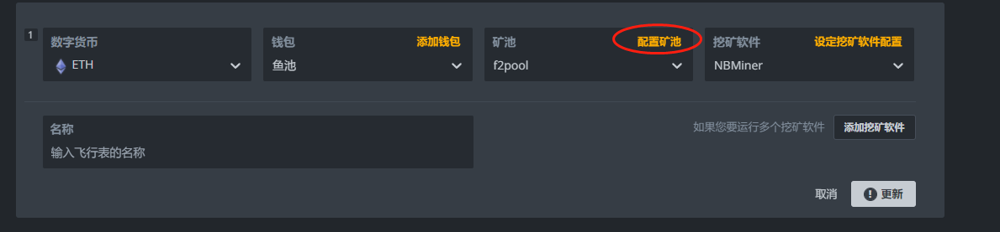
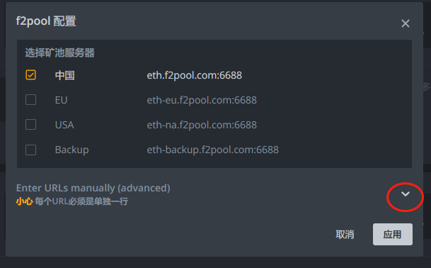
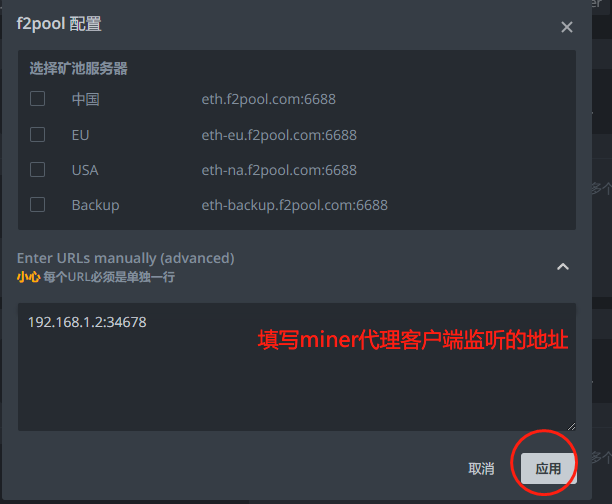

# tcp 加密代理
* 可以自定义密码通过AES对称加密流量,任何人都无法获悉流量数据包, 只要你的secret_key设置的足够复杂,几乎不可能破解
* 本程序是为了国内挖矿流量加密而设置, 客户端运行在矿场局域网任意一台机器内, 服务端可以选择在香港云服务器上
* 不同与其他ssl加密代理, ssl加密依旧可以通过中间人的方式去篡改数据, 而采用这种方式, 除非你的密钥泄露再无其他办法解密数据
* 所有代码开源, 不会存在任何抽水! 也不会开发反抽水(请尊重软件开发者)! 

## 安装
在Releases选择适合你系统的二进制文件下载

## 使用
* 分为服务端以及客户端
* 以f2pool挖erg为例
* 因为是在本地运行, 所以示例的ip, 服务端为: localhost, 客户端为: 127.0.0.1
### 服务端
```
# 监听 0.0.0.0:34567 并且转发请求到 erg.f2pool.com:7200
# 并且 服务端接受来自客户端的流量使用123456789密钥加密
./miner-proxy -l 0.0.0.0:34567 -r erg.f2pool.com:7200 -secret_key 123456789 
# 输出: 
> miner-proxy (0.0.0-src) proxing from 0.0.0.0:34567 to erg.f2pool.com:7200
```

### 客户端
```
# 监听 0.0.0.0:34568 并且转发请求到 服务端ip:34567 
# 并且客户端的流量使用123456789密钥加密
./miner-proxy -l 0.0.0.0:34568 -r localhost:34567 -secret_key 123456789 -client
# 输出:
> miner-proxy (0.0.0-src) proxing from 0.0.0.0:34568 to localhost:34567
```

### 使用者(与客户端处于同一台机器上或者同一个局域网内)
```
# 挖矿软件 Nbminer 设置
nbminer.exe -a ergo -o stratum+tcp://127.0.0.1:34568 -u perror.test -mt 3
```

## 矿工添加矿池示例
### 开源矿工
1. 
2. 
3. 点击保存后点击"主矿池"搜索第一步中填写的矿池名称

### 轻松矿工
1. 
2. 
3. 
4. 点击"确定"后返回主界面, "矿池"选择刚才填写的矿池名称

### hiveos
1. 
2. 
3. 
4. 点击"应用"后再点击更新即可

### 本程序基础转发代码来自 https://github.com/jpillora/miner-proxy 存储库